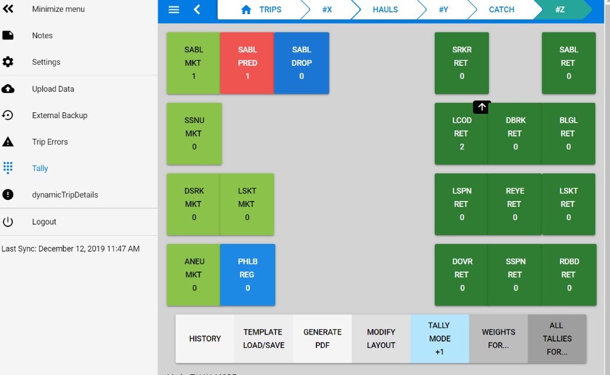

# Boatnet

Boatnet provides a suite of tools for collecting fisheries scientific survey and observer monitoring data while aboard commercial, recreational, and NOAA vessels. These include a tablet app for observers and surveys to capture their haul-level catch information and a mobile app for captains to keep track of observer-monitored trips. You can find more details about each project in this [section](https://github.com/nwfsc-fram/boatnet#projects)

<p align="center">
  
</p>

For those only interested in running the project follow the [How to build and run](https://github.com/nwfsc-fram/boatnet#how-to-build-and-run) section and ignore the rest. The remaining sections are for development purposes only. Note: We are currently working on simplifying the process and in the future you can just download an executable and run the application.

## Projects

Boatnet contains multiple projects located in different directories. The different projects are listed below.

### OPTECS (Observer Program Technology Enhanced Collection System)

**Directory**: apps/obs-wcgop-optecs

A tablet application used by observers to log information about fish caught on board. Observers can record stats such as weight, count, species type, and much more. The data collected is used to estimate how many fish can be sustainably caught.

### Observer Mobile App

**Directory**: apps/obs-web

A mobile app for our observer program where captains can log their trips and then see whether they are selected for observer coverage or not.

### Survey

**Directory**: apps/surv-*

Survey applications

## How to build and run
Boatnet uses the lerna + yarn workspace monorepo pattern.

1. Install Node.js - download [here](https://nodejs.org/en/)


1. (OPTIONAL) Install Visual Studio Code - download [here](https://code.visualstudio.com/) (We use and recommend this IDE for development)

<details><summary>OTHER OPTIONAL STEPS - Not recommended</summary>
<p>
* These are optional steps, not currently required.

1. (OPTIONAL) Install node-gyp by launching visual studio code as administrator and running the following from a terminal (Ref: https://www.npmjs.com/package/node-gyp):

- Windows: `npm install -g windows-build-tools`
- Mac: Ensure read/write access to /usr/local/lib/node_modules/npm/node_modules then run `yarn global add node-gyp`

1. In windows, you should run the initial build from a Visual Studio command prompt. This will install packages specified in packages.json. (re-run when other devs add packages to packages.json)

</p>
</details>

3. Clone the repository: `git clone git@github.com:nwfsc-fram/boatnet.git`

1. Install `lerna` globally: `npm install -g lerna`

1. Run `lerna bootstrap` (handles the `yarn install` automatically.)

1. Run `lerna run build` (builds all apps and libraries.)

1. Navigate to the project you need, e.g. `cd apps/example` and `yarn serve`

1. See more [specific `lerna` instructions](https://github.com/nwfsc-fram/boatnet#using-lerna) below.

## Further Development Setup

- Generate keys as described in the link on this page and add them to your GitHub account under settings->SSH and GPG keys

  - https://github.com/settings/keys

- If you are using Sourcetree, you need to import this key in PuttyGen (as described in their docs) and save the private key in .ppk format. Then, open Pageant from systray and Add Key using the file.
- Use ssh for git clone, otherwise you'll be prompted for HTTPS authentication upon `git push`

```
git clone git@github.com:nwfsc-fram/boatnet.git
```

    #### Precommit hooks

- Install the [git-secrets plugin](https://github.com/awslabs/git-secrets) on your PC to prevent accidental commit of secure tokens to Git.

  - Windows

            $ git clone https://github.com/awslabs/git-secrets

            # With administrator assistance:
            Create dir C:\Program Files\Git\usr\local\bin
            Copy git-secrets/git-secrets script to C:\Program Files\Git\usr\local\bin\git-secrets

            Create dir C:\Program Files\Git\usr\local\share\man\man1
            Copy git-secrets/git-secrets.1 help file to C:\Program Files\Git\usr\local\share\man\man1\git-secrets.1

            # For Visual Studio Code Integration
            Copy git-secrets/git-secrets script to C:\Program Files\Git\cmd\git-secrets

  - MacOS & Linux

            $ git clone https://github.com/awslabs/git-secrets
            $ cd git-secrets

            # then run:  brew install git-secrets  (on Linux run: make install)

- Activate plugin (repeat this activation step, whenever you git clone a new working copy)

        $ git secrets --install --force   #install hooks, in this working copy
        $ git secrets --register-aws      #add additional AWS credential protection for this working copy

## Contributing Guidelines

1. Create your feature branch (`git checkout -b feature/fooBar`) and develop your changes.
2. Verify your formatting is correct using Prettify: (`npm run format`)
3. Commit your changes (`git commit -am 'Add some fooBar'`)
4. Push to the branch (`git push origin feature/fooBar`)
5. Create a new Pull Request
   Specific detailed instructions can be found [here](./CONTRIBUTING.md)

## Using Lerna
* https://github.com/lerna/lerna
* You will no longer need `npm install` or `yarn install` for this workspace. Instead we'll be using:
  * `lerna bootstrap`  (Instead of `npm install`. Links local packages together and install remaining package dependencies)
  * `lerna add whatever-package` (Add a single dependency to matched packages)

* For boatnet, we are using the Lerna and Yarn Workspaces monorepo pattern. This will minimize node_packages redundancy.
  * Note that each app/library/etc can be standalone, however, we want to use lerna/yarn to make development easy.
* [Required] Install lerna globally
```
npm install -g lerna
```
  * If this isn't an option for you (permissions or whatever,) you can use `npx lerna <command>` for the lerna commands instead.

* Lerna is already configured for boatnet, see the root `lerna.json` and `package.json` for the specifics.
* Lerna commands can be executed from any folder in the project
* Yarn doesn't use `package-lock.json` files. If you see one of these, you can delete it. It might indicate that you accidentally used npm.

* Getting started:
```
cd /c/git/boatnet/
lerna bootstrap
lerna run build
```
### Creating and configuring dependencies for a new app, library, or tool:
* Create a ticket and make a branch:
```
git pull
git checkout -b 'new-wcgop-optecs'
```
* Create your app in apps/ (or lib in libs/, tool in tools/) and add to source control:
```
cd apps/
vue create obs-wcgop-optecs
cd obs-wcgop-optecs
git add .
```
* Modify your new `package.json` to be private:
```
"private": true,
```
* Run lerna bootstrap. This adds your new project to our workspace (you only need to do this once for your new project. It searches for your new package.json.)
  * This also replaces `npm install`/ `yarn install` for our workflow! You'll be using `lerna add` from now on.
```
lerna bootstrap
```
* Build everything
```
lerna run build
```
* Add whatever dependencies using `lerna`.  like this. Note that these dependencies are available to ALL projects, so you may not need to add anything. You should include the `@types` packages as well if available.
```
lerna add crypto-js
lerna add --dev @types/crypto-js
lerna add pouchdb-browser
lerna add --dev @types/pouchdb-browser
lerna add something-weird --scope='obs-my-weird-app-only'
(etc)
```
* Run your app:
```
cd apps/obs-wcgop-optecs
yarn serve
```
* Delete all node_modules folders (might be useful)
```
lerna clean
```
See the [lerna docs](https://github.com/lerna/lerna) for more functionality
