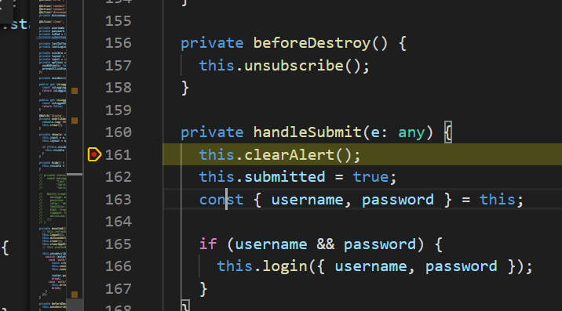

# Configuring VS Code Debugger

- Based on https://vuejs.org/v2/cookbook/debugging-in-vscode.html

## Install Chrome debugger

- I already had it installed, but check here:

https://marketplace.visualstudio.com/items?itemName=msjsdiag.debugger-for-chrome

## Create/ update `vue.config.js` (same level as `package.json` in your app)

- This file will already exist if you have Quasar configured.

```
cd /c/git/boatnet/apps/obs-wcgop/optecs
touch vue.config.js
```

- Add this to your `vue.config.js`

```
module.exports = {
  // (Leave other stuff here if exists),
  configureWebpack: {
    devtool: 'source-map'
  }
}
```

## Configure debugger launch configuration in VS Code

- Click the Debug icon on left (bug with x on it)

- Click the Gear icon at the top of the debug window (Next to No Configurations)
  
- Replace content of `launch.json` with this. :
  **NOTE: THIS IS FOR ASHOP. ADJUST YOUR webRoot PATH APPROPRIATELY.**

{
  "version": "0.2.0",
  "configurations": [
    
    {
      "type": "chrome",
      "request": "launch",
      "name": "vuejs: chrome",
      "url": "http://localhost:8080",
      "webRoot": "${workspaceFolder}/apps/ashop/src",
      "breakOnLoad": true,
      "sourceMapPathOverrides": {
        "webpack:///./src/*": "${webRoot}/*"
      }
    }
  ]
}

```

## Serve and Debug

- Serve your app

```
yarn serve
```

- Add breakpoints
  - Click and add red breakpoints directly in VS Code to the left of the line numbers.
  - You can add a manual breakpoint in code by adding the `debugger` keyword. Remove it before committing code (tslint should complain about it as a reminder.)
```

- Launch the VSC debugger
  - With your app running, click the green arrow at the top of the debug window (with `vuejs: chrome` configuration selected)
  - This will launch a Chrome browser instance that should link back to your debugger breakpoints.
  - you can watch variables, etc, like any debugger.
  
  
 
