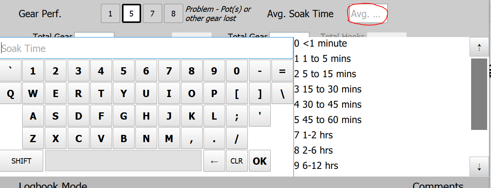
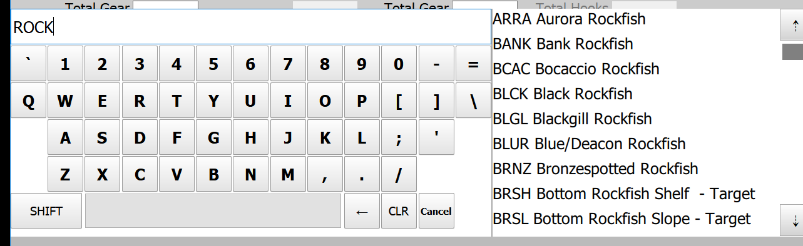
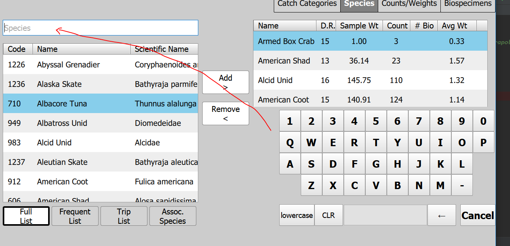
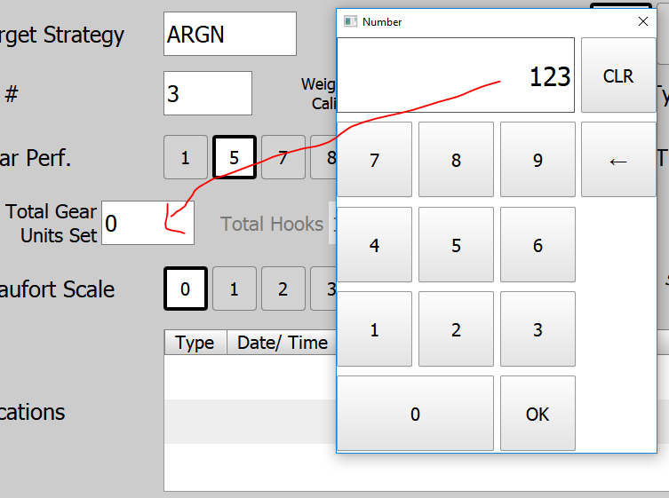
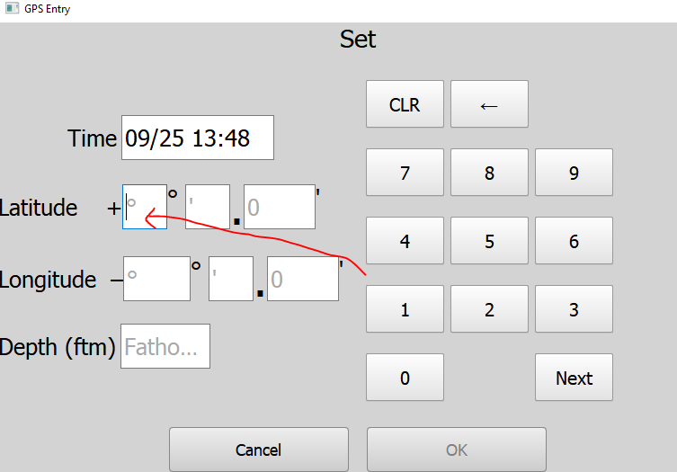
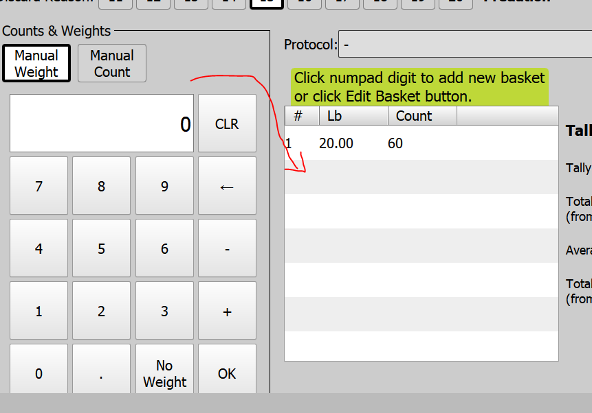
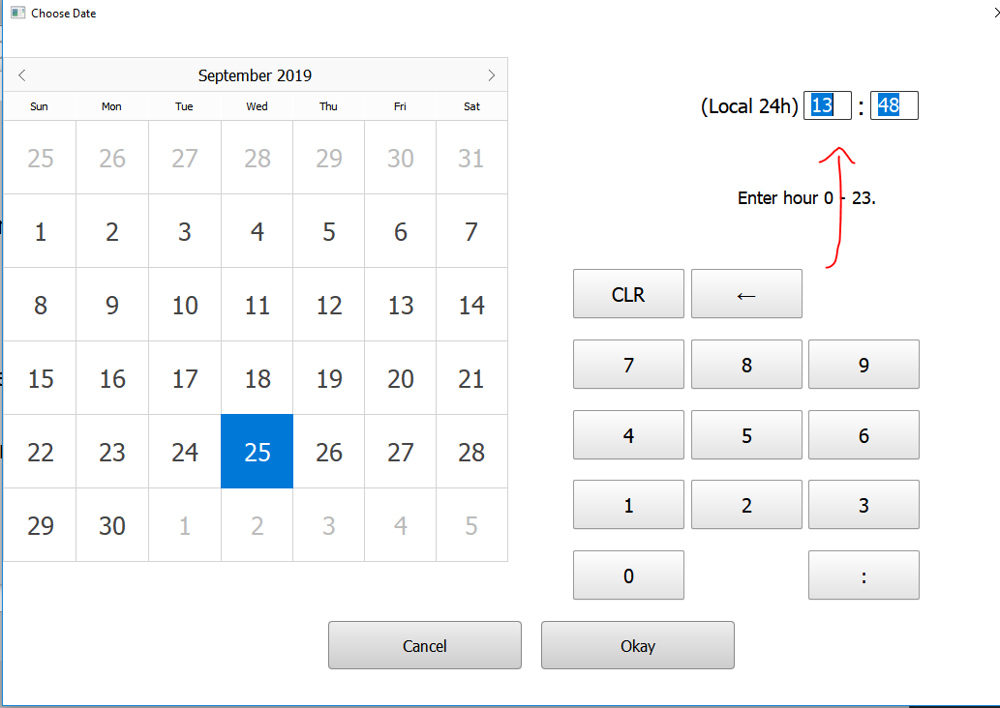

Welcome to...

---

For your consideration in future touchscreen/ "bad stylus" friendly components:

---

## Keyboard Exhibit

- User clicks on field, keyboard and prepopulated choices appear (cannot "OK" on arbitrary text, can only "OK" on nothing or simply click on one of the items on the right to select it):

- Search on a 4-letter code OR on a common name substring:

- Temporarily appear embedded directly in the UI, disappear after entry. As user enters text, the table below filters by substring search:

## 

## Numpad Exhibit

- Popup-style numpad. User clicks numeric entry field, popup appears. User inputs number, hits OK, and it populates the field (cancels by hitting X):

- Direct entry numpad, always on the screen. Auto-tabs through the fields as user enters valid data:

- Embedded numpad with custom buttons depending on context:

## 

## Date/Time Picker Exhibit

- User clicks on field, this gigantic thing appears. The numpad on the right is for quick direct input of time:

