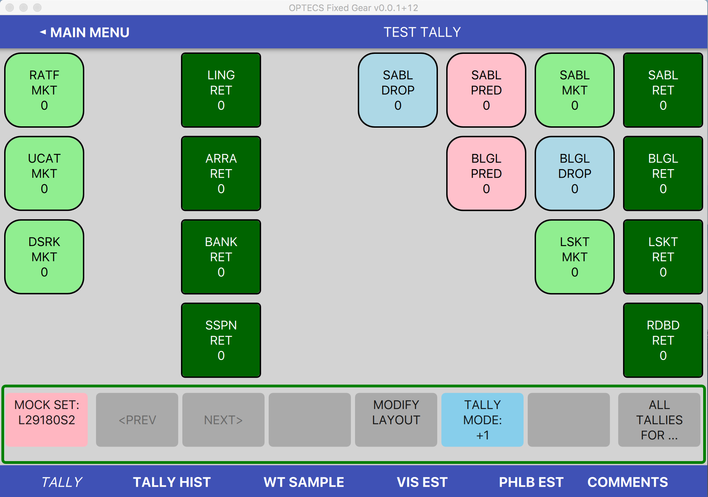

# Tally Screen Design Notes

A prototype of the tally screen was developed in late 2017 using PyQt and
extensively reviewed by the Newport Observer Team (Eric Brasseur,
Jason Eibner, and Ryan Schama).

This document uses screenshots, with notes, to describe the functionality.

## Design Influences

Data analysis of over 10K fixed gear sets over four years
from 2014 to 2017 yielded these findings:
* Over two thirds of tallies will be for retained,
one third for discard reasons of all types.
* Four of the nine discard reasons account for over 99%
of discard tallies: Market, Regulatory, Predation, and Drop.
* Most tallies for hauls/set will fit in an 8x4 grid (see Appendix for details)

## Initial Screen

There are four sections in the tally screen:
* A standard navigation and title bar at the top
* A grid to hold 8 columns by 4 rows of species buttons
(there is a mode for a 6 column by 3 row layout).
* A control row that can display different sets of buttons for:
    * Navigation and control (shown above)
    * All tallies (all discard reasons and retain) for one species
    * Modify grid layout options (add/move/delete buttons)
* A bottom row for related functionality, such as tally history,
weight sampling, or visual estimates)

The tablet by default is set up for use when held in the left
hand.

The most frequently used buttons are placed near
the most ergonomically accessible right edge
(because buttons are hit by a finger of or stylus in the right hand).

It is recommended that retain buttons be placed near the
ergonomic edge. This recommended placement knowingly
goes against the paper tally convention
of placing retain buttons towards the left and discard reasons
toward the right.

It is also recommended that tally buttons for a given species
be grouped together, in the same horizontal row. That is in line
with the current paper layout.

This placement of frequently-used buttons near the right edge
is merely a suggestion: the observer is free to move buttons
and create tally templates with a different scheme.

Each tally button holds the species abbreviation, its disposition
(retain or a specific discard reason), and a count.

Because retain buttons are so heavily used, they
are therefore emphasized vis-a-vis discard buttons with the
following reinforcements:
* Retain buttons are more squared and have more area.
* Retain buttons have a dark green background with light text
while discard buttons have lighter backgrounds and dark text.
* Retain buttons are placed (by recommendation) near the
ergonomic edge.

The pink "Mock Set" button on the left of the control row
is a prototype artifact to allow toggling through a set
of sample long line, long line, and pot tally templates.
in the actual tally tablet, it will be replaced with tally template
definition screen where saved templates can be reviewed, modified,
and chosen for use.

The four most frequently used discard tally buttons were assigned
their own color, with this rationale:
* Market is light green, closest in color to Retain,
because these fish are market candidates but for their small size.
* Predation is pink because predation often results in blood released.
* Drop is light blue because they drop back into the blue sea.
* Regulatory is yellow because it's a yellow flag (OK, the weakest :-)

These colors are not overridable in the prototype.
In the actual tally screen, they should be definable by observers to allow
color-blind observers to specify colors distinctive
to their eyes.

#### Same initial screen reversed for use in right hand

Note the order of the button in the control row is reversed as well,
with the most frequently used button, all-tallies-for, placed
nearest the ergonomic edge.

#### Setting Screen

The tablet in left hand or in right hand is discussed above.

Some observers may wish to have bigger buttons. A  6x3 grid
was supported in the prototype. Those two choices may be sufficient.

Some reviewers thought that observers, after tallying a rare
discard reason by pulling up the all-tallies-for control row,
would like the control row to "snap back" to the default row.
An option was provided for that behavior, but the default
was to allow all-tallies-for to stay up until explicitly
dismissed with the red "Done with XXXX" button.

Observer-specified color schemes was not implemented in the prototype.

#### Decrement Mode

When a tally button is clicked, the observer is given visual and auditory
feedback. Visually, the button's text is emboldened and a white outline
added (feedback is the outline is way to subtle for backdeck use).

The highlight of a decremented tally button is different
from an increment: an orange outline rather than white and
the text is underlined:

The highlighting in the prototype of both the last incremented and the last
decremented tally buttons is likely too subtle for the harsh
lighting conditions of the back-deck and should be made
more emphatic.tally_add_tally_choose_DR.png

Different sounds are used for successful increment, successful decrement,
and an unsuccessful decrement when the count has already reached zero.

### Using the All-Tallies Row for rare discard reasons

When the rightmost button in the default control row, the "All Tallies For ..."
button, is pressed, all the buttons in the grid are set to blinking
so that a button for that species can be selected:

After a species is selected, the contents of the control row change
to the full set of discard reasons for that species, with current tally counts:

* All buttons in grid for selected species are highlighted (thick border)
* All discard reasons in the control row that are already in the grid
are highlighted (thick border).

### Modify grid layout
When the "Modify Layout" button of the default control row is pressed,
the control row is used to display all the modify options:

#### Modify grid layout: add button to already present species
When the "Add Tally" button is pressed, all of the grid tally buttons
are set to blinking:

The observer clicks one to choose a species. After the species is chosen,
the control row shows all the discard reasons for that species - without
the tally counts. The discard reasons already displayed in the grid are
grayed out in the control row.

The user selects a discard reason not already in the grid.
In this example, the observer selects "REG" (Regulatory),
at which point all the empty cells in the grid are set to blinking:

In this example, the observer selects the second row from the top
and the fourth column from the left:

The new tally button is placed and temporarily highlighted.
The highlight goes away with the first click on the grid.

#### Modify grid layout: add named new species to grid

When the "Add Named Species" button is pressed, a popup window
is presented for the observer to enter a species name. (Not shown here).

After the observer enters a species abbreviation and clicks OK,
the control row displays all the possible discard reasons, and retain,
for that species. The reasons don't show a tally count. The tally
reasons are all set blinking, inviting the observer to chooose one:

After the observer selects a reason (here "Reg"), the empty cells in the grid
are all set to blinking, inviting the observer to select where then new
tally button is to be placed:

In this example, the observer chooses the bottom left:

The newly added tally button is temporarily highlighted (highlight removed
on the next mouse click).

#### Modify grid layout: quick add of temporary species

The motivation of this functionality is to allow the observer to
quickly add a tally button with as few steps as possible, namely three.

The first two:
1. Click the "Modify Layout" button
2. Click the "Add Temp Species" button

The control row content is changed to all the discard reasons, and retain,
all set to blinking:

When the observer chooses a reason (the third click), a clearly temporary names
is assigned and a location in the grid is assigned (as near as possible
to bottom left, row major):

#### Modify grid layout: name a temporary species
The "Name Temp Species" button is enabled only if the grid contains
at least one temporary button is in the grid.

When the observer clicks the "Name Temp Species" all of the temporary
tally buttons (with an abbreviation in the form "(TEMP1)" are set
to blinking.

When the observer selects a temporary button, a pop-up window to allow
an actual species abbreviation will be displayed. (This prototype
doesn't yet have a species pulldown):

After entering a species abbreviation and clicking OK, the temporary
tile is renamed (not shown).

#### Modify grid layout: delete a zero-count tally button
When the observer clicks the "Delete Tally" button, all tally buttons
in the grid with a zero count are set to blinking:

When the observer clicks on a tally button, it is removed from the grid
(not shown)

#### Modify grid layout: move a tally button
When the observer clicks the "Move Tally" button, all tally buttons
in the grid are set blinking:

When the observer chooses a button to move, the chosen button is highlighted
(here ABCD in the bottom left corner) and all empty cells are set to blinking:

When the observer chooses an empty cell (here the third row from the top
and the fourth column from the right), the tally button is moved there:

### Tally History

Brought up by clicking the "Tally Hist" button in the
bottom blue bar. Placed away from the ergonomic edge
(tablet-in-right-hand mode places on right side).

Note absence of OK button: click anywhere out of tally history
window will dismiss the popup.

# Multiple pages for one set

It is a rare set that will require more than 32 cells -
all but 4 out of 11K+ sets will fit. Even a 6x3 grid will fit
all but 282. See Appendix for details.

But there will be some, so
provide previous/next buttons. But two pages may be enough,
which would simplify to having _either_ a previous or next
button.

## Appendix

### Overflow

In January 2018 the OPTECS program team asked how many sets (hauls) would likely
require a second (overflow) page for tallying due to a large number of tally
buttons.

I looked at 11K fixed gear sets from 2014 to 2017 inclusive:

Summary
* A 8x4 grid would handle all but 4 of the 11K+ sets on one page, assuming all 32 cells were used.
* Even using 25% of cells for spacing, a 75% full 8x4 grid would handle all but 18 of the sets.
* A 6x3 grid would handle all but 282 of the 11K+ sets on one page; i.e. 24 out of 25 sets could be handled on one page.
