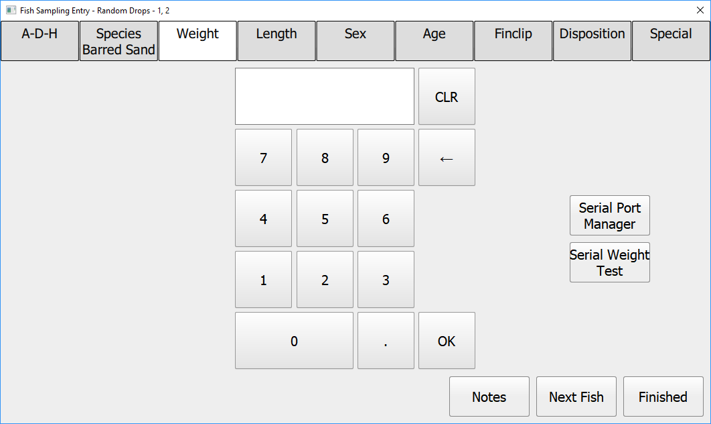

Welcome to...

---

For your consideration in future touchscreen/ "bad stylus" friendly components:

---
There are two quite different backdeck stations on the hook and line survey:  HookMatrix and CutterStation.  

## HookMatrix
The HookMatrix user is focused on working closely with the 3 anglers as they retreive the fish from their rods and reels.  As the potentially five fish are brought to the deck (each gangion has 5 hooks on it), the HookMatrix user will speciate them, print out barcoded labels identifying the species and angler/hook position, and then staple those labels to each fish. The fish are then shuttled to the CutterStation where they are sampled.

## CutterStation
The CutterStation is where the individual fish sampling occurs, where items such as the fish sex, length, weight, etc. are captured.

## Numpad Exhibit

This number pad is used at the CutterStation for manually capturing weights (they can also be captured automatically via the Marel scale).  The Length, Age, and Finclip tabs have similar number pads.

