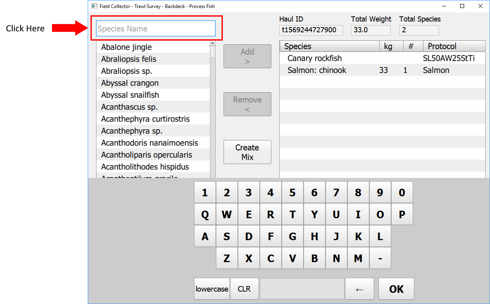
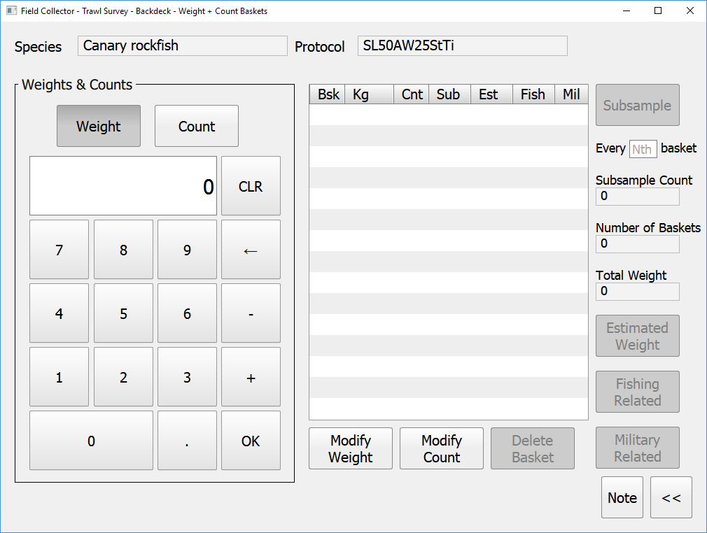
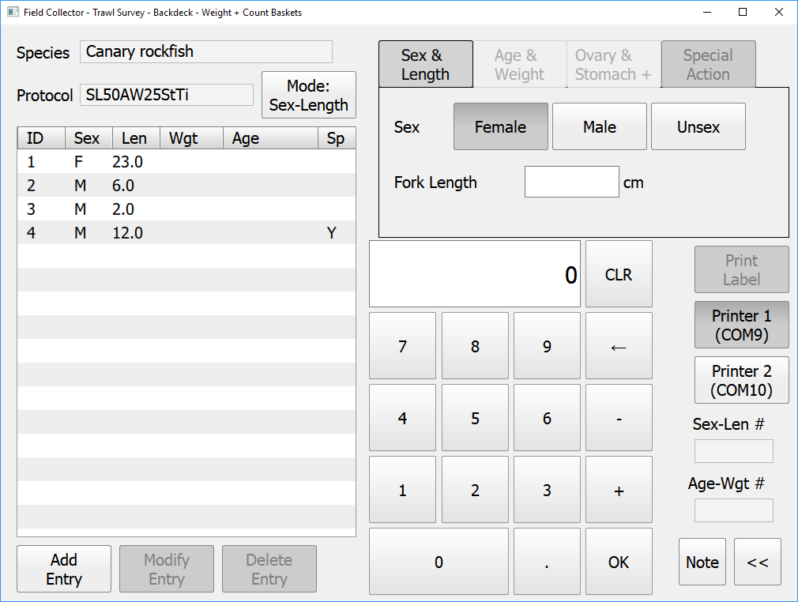
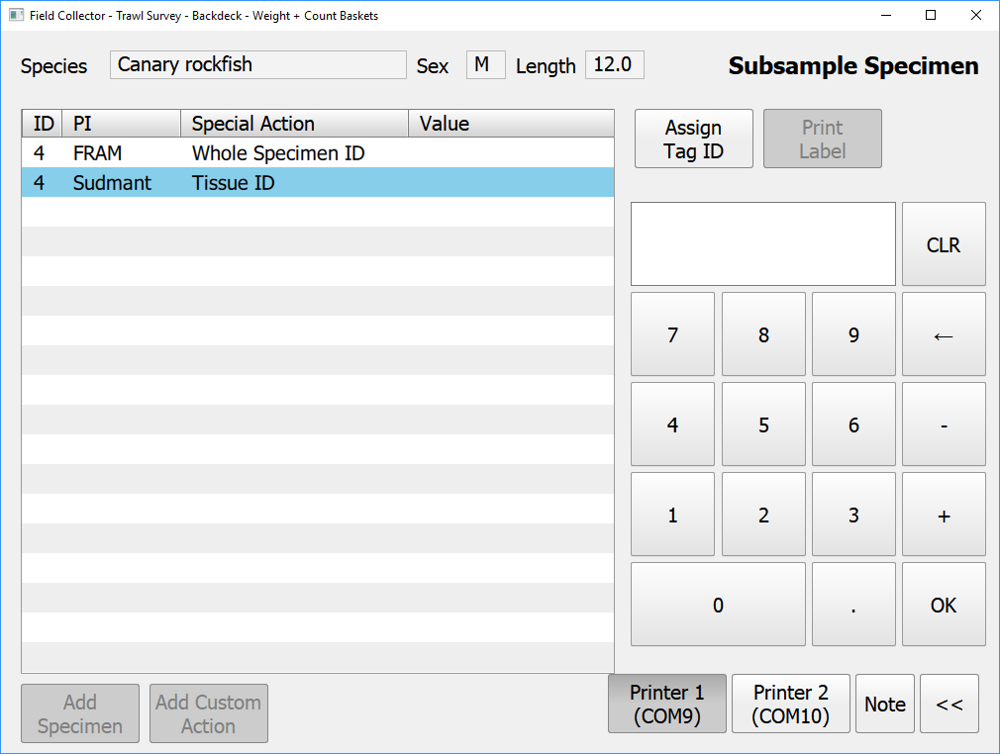
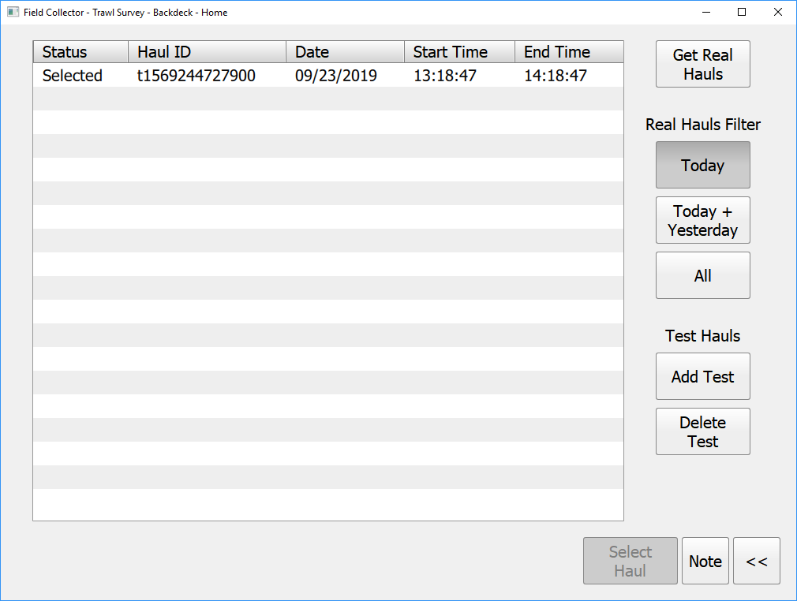

Welcome to...

---

For your consideration in future touchscreen/ "bad stylus" friendly components:

---

## Keyboard Exhibit

### Catch View
User clicks on a textfield and a keyboard appears, auto-filtering the listbox of values:

## Numpad Exhibit

All of the number pads used on the trawl survey backdeck software are the same. 

### Weights and Counts View
On this screen, the user starts typing in a value into the numpad, clicks OK, and it adds a new row to the table on the right.  You'll notice that the Weight button is selected, that toggles over to the Count button once the weight has been entered.

### Catch View
This number pad acts slightly different in that the user first clicks in the associated textfield (in this example, into the Fork Length field).  Then once a numeric value is entered and the OK button clicked, it enters that value back into the Fork Length textfield.

### Special Actions View
On this view, a user highlights the row of interest in the left-hand table, enters the value on the numpad, clicks OK, and the value then appears in the value column of the highlight row in the table

## Hauls View
Below is the hauls view where a user can double click or highlight a row and click Select Haul (in lower right) to select that haul as the active haul
