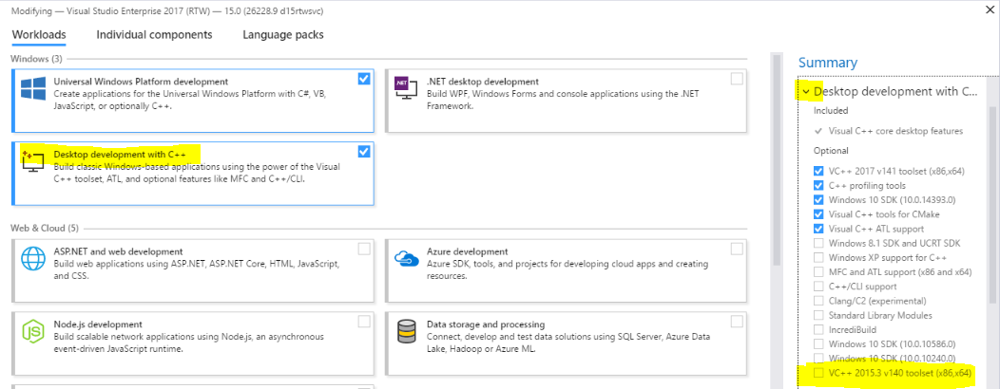

# ObserverElectron
"Hybrid" web-based and electron app.

For those only interested in running the app just follow the installation section. 

## Installation
### Windows:
* Argon2 - This tool is used for authentication purposes. In order to install this module you need Visual Studio 2017. Download it from [here](https://visualstudio.microsoft.com/downloads/?utm_medium=microsoft&utm_source=docs.microsoft.com&utm_campaign=button+cta&utm_content=download+vs2017) and select the **community free download**. Run the installer and select **Desktop Development with C++**, be sure to select the **VC++ 2015.3 v140 toolset(x86,x64)** box on the right hand column. The image below displays what to select. 

<p align="center">
  
</p>

* Windows build tools - This installs Visual C++ Build Tools used to compile native add on modules. To install start PowerShell as Administrator and run:
```
npm install --global --production --vs2015 windows-build-tools
```
* OpenSSL v1.0.2 and v1.1.0 - To build correctly on Windows, the crypto-pouch library requires OpenSSL v1.0.2 AND v1.1.0 to be installed to C:\OpenSSL-Win64\ (which is not the default install directory.)
Two installers are required:
http://slproweb.com/download/Win64OpenSSL-1_1_0i.exe (note the "i" version.)
http://slproweb.com/download/Win64OpenSSL-1_0_2p.exe
If installed correctly, the build will be able to locate the file C:\OpenSSL-Win64\lib\libeay32.lib

### Troubleshooting 
If you get an error: missing C:\Microsoft.Cpp.Default.Props after running npm install open a VS 2017 developer command prompt and run "npm install" from there.

## Development - Build required shared fram-models module

obs-electron has a dependency on fram-models, located in fram-modules. Currently building this is a manual process:

```
cd boatnet/fram-modules/
ng build fram-models
```

## Development - Web Based
* If losing the electron capabilities is OK, you can develop and serve the pages via:
`ng serve`
as if this was a normal electron app.

## Development - Electron Based

### Development - Build and Run Electron
Run `npm run electron-build-run` for an electron dev build, or `npm run electron-build-prod` for an optimized production build. Refer to `package.json` for various scripts available.

### Two terminal development
Alternatively, in one terminal, I run `npm run build-watch`, and in another, `npm run electron`. This auto-recompiles on code changes, although have to ctrl-R to refresh the electron app to see updates. [TODO: fix if not working]

## Build Electron distribution
`npm run electron-package-fast`

## Access to Electron shell
* Refer to docs at https://github.com/ThorstenHans/ngx-electron
* `ElectronService` is injected in `app.component.ts` for electron service access examples
